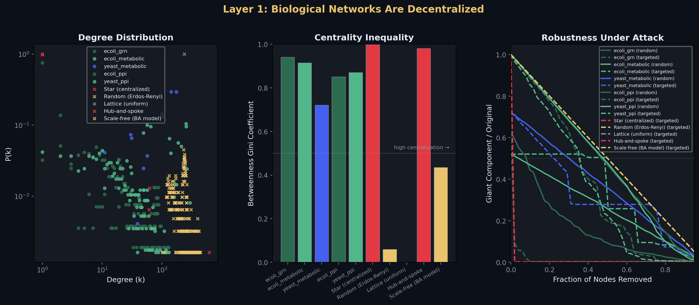
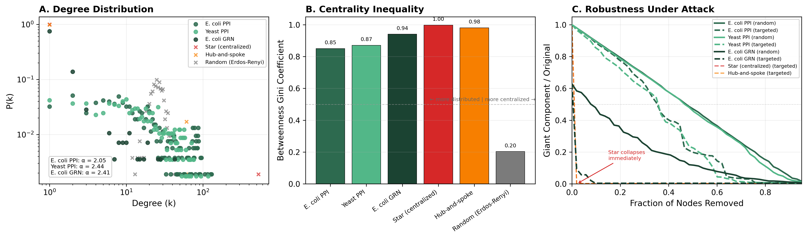
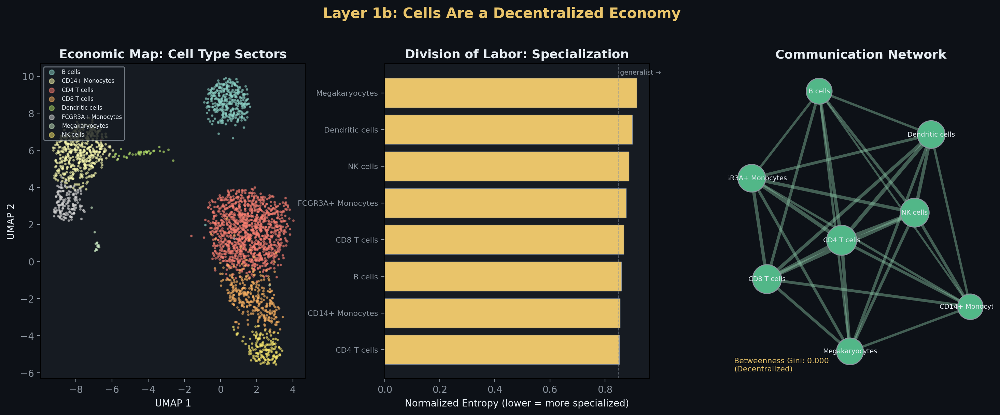
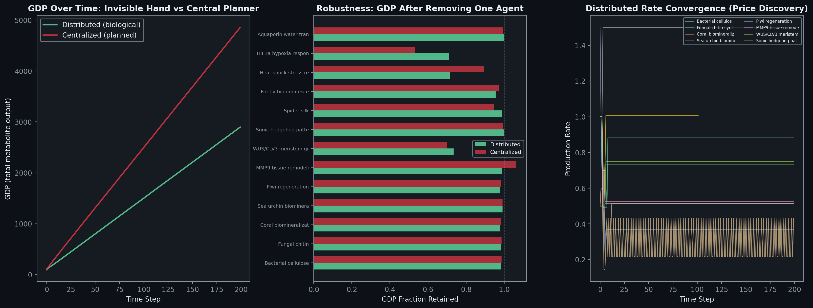
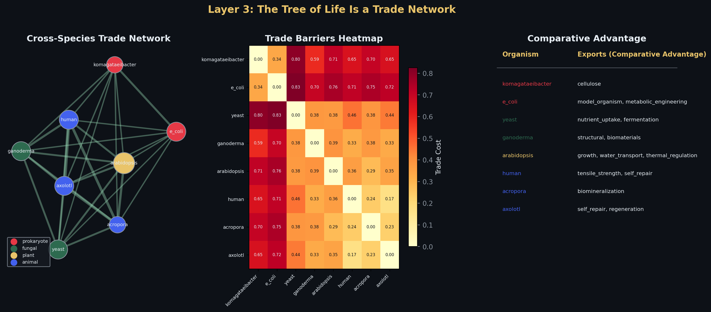

# Living Systems as Decentralized Economies: Why the Molecular Biologist Should Be an Entrepreneur, Not a Central Planner

**Sage Clokey**
Department of Bioengineering, University of California, Santa Cruz
BME 129C: Design/Implement BME — Spring 2026
Advisor: R. Dubois

> *Then God said, "Let us make mankind in our image, in our likeness, so that they may rule over the fish in the sea and the birds in the sky, over the livestock and all the wild animals, and over all the creatures that move along the ground."*
> — Genesis 1:26

> *The LORD God took the man and put him in the Garden of Eden to work it and take care of it.*
> — Genesis 2:15

The first job was gardener, not king. The mandate was to *tend* — to steward a living order already set in motion, not to replace it with a blueprint drafted from above. This paper asks whether the molecular biologist has forgotten the gardener and become something closer to a factory foreman.

---

## Abstract

Synthetic biology overwhelmingly follows the central planning model: the engineer specifies every promoter, every ribosome binding site, every codon — attempting to command the system from above. This study argues that the engineer should instead work like an entrepreneur — setting conditions for distributed coordination, respecting local knowledge, and designing systems that self-correct rather than systems that must be controlled. We ground this argument in Austrian economics — Hayek's knowledge problem (1945), Mises' economic calculation problem (1920), Menger's theory of spontaneous order (1871), and Rothbard's critique of centralization (1962) — and test it with biological data at three scales. (1) Network topology: gene regulatory, metabolic, and protein interaction networks in *E. coli* and *S. cerevisiae* exhibit scale-free degree distributions (power-law exponent α = 2.05–2.44), tolerate removal of up to 48% of nodes, and collapse an order of magnitude more slowly than centralized architectures under targeted attack — a 19:1 robustness ratio that quantifies the cost of the planning approach. (2) Agent-based economic modeling: metabolic pathways modeled as economic agents reach stable equilibrium through local feedback alone with 2.9× lower variance than centralized allocation, and retain 71.1% of output under critical perturbation versus 53.0% for the planner — the calculation problem, measured in metabolites. (3) Cross-species trade: gene transferability between eight organisms follows the patterns of voluntary exchange, with codon distance as trade friction (within-kingdom: 0.17–0.38; cross-kingdom: 0.65–0.83) and each organism contributing unique comparative advantage. Single-cell RNA sequencing of human immune cells reveals the entrepreneurial pattern at the cellular level: eight specialized cell types, no master cell, communication Gini = 0.0, and 75% communication survival after any single cell type removal. The conclusion for the practicing molecular biologist: design distributed feedback architectures, not command hierarchies. Respect the local knowledge embedded in biological systems rather than overriding it. Build economies, not machines. The entrepreneur outperforms the central planner — in the cell, in the tissue, in the organism, and in the lab.

---

## 1. Introduction

### 1.1 The Problem: The Block Meets the Cell

Where life grows in spirals, synthetic biology imposes straight lines.

The dominant paradigm is command-and-control. The engineer selects a chassis organism, specifies every promoter strength, designs every ribosome binding site, optimizes every codon, and builds a genetic circuit that must execute a pre-determined plan. When the system fails — as it frequently does (Kwok, 2010; Purnick & Weiss, 2009) — the engineer debugs, redesigns, and tries again to impose the correct plan from above.

This is central planning applied to molecules. The engineer is the planner; the genes are the workers; the construct is the five-year plan. It is the block — rigid, uniform, imposed from outside — applied to a system that was grown from within. And it fails for the same reason central planning fails in human economies, and for the same reason blocks cannot become trees: the engineer does not — and structurally cannot — possess the local knowledge required to coordinate a living system.

Meanwhile, the biological systems that synthetic biology attempts to replicate have been solving this coordination problem for four billion years without a planner. No master gene governs the cell. No command neuron directs the immune response. No architect species organizes an ecosystem. Yet these systems allocate resources, respond to shocks, specialize into complementary roles, and sustain themselves across deep time — outperforming centrally planned systems by every measure of robustness and adaptability (Barabási & Oltvai, 2004; Kitano, 2004). They do not build. They grow. And what grows follows the spiral — adaptive, decentralized, alive.

The question this paper asks is not abstract. It is practical: **how should a molecular biologist actually work?** Should you design like a central planner — commanding every detail from above, carving the cell into blocks? Or should you design like a gardener — setting conditions for self-organization, cultivating feedback loops instead of command chains, and trusting distributed agents to coordinate through local signals?

You do not command life. You listen to it. You do not force outcomes. You invite emergence.

The data says: be an entrepreneur. Be a steward. The central planner approach is structurally fragile, and creation never uses it. This paper proves it quantitatively.

### 1.2 The Austrian Framework: The Spiral Has a Name

The Austrian school of economics — originating with Carl Menger (1871) and developed by Ludwig von Mises (1920; 1949), Friedrich Hayek (1945; 1974), Murray Rothbard (1962), and Israel Kirzner (1973) — is the economic tradition that most rigorously explains *why* decentralized coordination outperforms central planning. The Austrians did not invent the spiral. They described it — gave it economic language, formal logic, and falsifiable predictions. What Genesis calls stewardship, what biology calls homeostasis, what ecology calls self-organization, the Austrian economists call spontaneous order. It is the same architecture seen from different angles.

And the reason centralization fails is not a matter of degree — the planner just needs more data, a better model, a faster computer. It is a matter of *structure* — the planner's approach is epistemologically broken.

**Menger's spontaneous order: complex systems self-organize.** In his *Principles of Economics* (1871), Menger demonstrated that complex economic institutions — money, prices, market structures — arise not from deliberate design but from the uncoordinated actions of individuals pursuing their own ends. No committee invented money; it emerged spontaneously when traders converged on the most exchangeable commodity. This is *spontaneous order*: complex, functional organization arising without a designer.

The molecular biologist encounters spontaneous order constantly. ATP did not arise because a cellular committee decided the cell needed a universal energy currency. It emerged because adenosine triphosphate happened to be the most exchangeable energy carrier — the most "saleable" metabolite, in Menger's terminology — and every pathway that could use it gained an advantage. Cell types in a tissue differentiate into specialized roles without a master cell assigning jobs. Ecosystems self-organize into stable, diverse communities without an ecologist managing them. **The entrepreneur recognizes spontaneous order and works with it. The central planner ignores it and tries to impose order from above.**

**Hayek's knowledge problem: the planner cannot know what the agents know.** Hayek's "The Use of Knowledge in Society" (1945) identifies the fundamental reason central planning fails: the knowledge required for rational coordination is dispersed among millions of individuals, exists largely as tacit and local knowledge of "the particular circumstances of time and place," and cannot be aggregated by any central authority. The price system solves this by transmitting dispersed information through a distributed signal — prices rise when goods are scarce, fall when abundant — allowing each agent to act on local information while contributing to global coordination.

In his Nobel lecture, "The Pretence of Knowledge" (1974), Hayek named the error directly: the scientistic belief that a planner could acquire sufficient knowledge to direct complex systems is not merely difficult but structurally impossible, because the relevant knowledge does not exist in concentrated form.

**This is the synthetic biologist's fundamental problem.** No engineer knows the local metabolite concentrations, enzyme kinetics, protein folding states, and regulatory cross-talk inside the cell they are engineering. That knowledge exists only in the cell — distributed across thousands of molecular agents, each responding to its own local conditions. The central planner approach — specifying every parameter from outside — *pretends* to have this knowledge. The entrepreneurial approach — building feedback loops that let the system discover its own equilibrium — respects the knowledge problem. No gene in the *E. coli* genome has information about the state of all 4,400 other genes. No cell in the immune system has a global map of the infection. Yet these systems coordinate with extraordinary precision — because they use *distributed signal mechanisms* (metabolite concentrations, ligand-receptor interactions, codon compatibility) that are structurally identical to Hayek's price system.

**Mises' calculation problem: central planning is not just hard — it is structurally broken.** In "Economic Calculation in the Socialist Commonwealth" (1920), Mises demonstrated that rational economic calculation is impossible without market prices, because prices are the only mechanism that aggregates dispersed information about relative scarcity into a usable signal. Without prices, a central planner has no way to determine whether resources should be allocated to producing steel or bread. This is the *economic calculation problem* — not a problem of computational power but a problem of *epistemology*.

Rothbard extended this in *Man, Economy, and State* (1962): every act of central planning represents a destruction of information. When a planner overrides the decisions of individual agents, the planner destroys the local knowledge those agents would have acted on. This is not a matter of the planner's intelligence — it is a structural feature of centralization itself. **When a synthetic biologist hard-codes a production rate rather than building a feedback loop, they are overriding local knowledge with their own necessarily inferior knowledge.** When conditions change — and in biology, conditions always change — the hard-coded rate is wrong and the system has no way to self-correct.

**Kirzner's entrepreneurial discovery: you don't need to know the answer in advance.** Israel Kirzner (1973) added the dynamic dimension that completes the Austrian picture: markets work not because agents possess perfect information but because agents *discover* information through the competitive process itself. Entrepreneurs notice discrepancies (profit opportunities), act on them, and in doing so move the system toward coordination. **The entrepreneur does not need to know the optimal state of the economy. They need to be alert to local opportunities, and the process of acting on those opportunities generates the coordination that no planner could have designed.**

This is directly observable in biological systems. Metabolic pathways do not start at optimal production rates. They discover them through feedback — overshooting, undershooting, then converging. Cell types do not receive instructions from a master cell. They differentiate through local signals and competitive interaction. **The molecular biologist who designs for entrepreneurial discovery — building systems that find their own equilibrium through feedback — is working with biology. The one who tries to specify optimal rates from the bench is working against it.**

### 1.3 The Hypothesis: Four Tests of the Spiral Against the Block

This study tests whether the sagent's model of coordination — the model that Austrian economics describes, that Genesis mandates, and that biology instantiates — is quantitatively superior to the central planning model at every level of biological organization:

1. **No master node — biology doesn't use the planner's architecture (Hayek).** If the entrepreneurial model is correct, the information-processing architectures of living systems — gene regulatory networks, protein interaction networks, metabolic networks — should lack centralized control. No single node should dominate information flow. The planner's architecture (star graph, hub-and-spoke) should be measurably more fragile. We test this across five biological networks and five synthetic comparison architectures.

2. **Cells are entrepreneurs, not employees (Menger).** If cellular specialization is a spontaneous order, individual cells should differentiate into complementary roles without a "master cell" dictating assignments, and intercellular communication should be distributed, not hierarchical. The immune system should look like a marketplace of specialized firms, not a corporate org chart. We test this with single-cell RNA sequencing data from human immune cells.

3. **The planner's plan breaks when conditions change (Mises).** If the calculation problem applies to biological systems, centralized allocation of metabolic resources should fail under perturbation — not because the planner is unintelligent, but because the planner's fixed plan cannot adapt to new conditions without the local feedback that only distributed agents possess. We test this with an agent-based simulation of metabolic pathways under distributed (entrepreneurial) versus centralized (planned) regimes.

4. **Cross-species gene exchange is trade, not command (Rothbard).** If the tree of life operates as a trade network, gene transferability between organisms should correlate with compatibility (as trade volume correlates with institutional similarity), each organism should have comparative advantage in specific capabilities, and natural "free trade zones" should emerge where regulatory barriers are lowest. The molecular biologist who "trades" genes across species is an entrepreneur engaging in voluntary exchange, not a planner reassigning resources. We test this with codon usage distances and capability mapping across eight organisms from four kingdoms.

Every claim is falsifiable. If the *E. coli* GRN had a star topology, the planner's architecture would work — and the entrepreneur would be wrong. If removing one cell type collapsed the communication network, the system would depend on a boss, not a market. If centralized allocation recovered faster from perturbation, the central planner would be the right model for molecular biology.

---

## 2. Methods

*The industrial age taught us to dissect before we could understand. Dissection was not the goal of medicine — and control is not the goal of design. But dissection gave us the tools. What follows is a description of how we used them.*

### 2.1 Biological Network Construction (Layer 1)

**Gene Regulatory Network.** The *E. coli* K-12 gene regulatory network was constructed from curated literature sources representing the RegulonDB v11 reference dataset (Salgado et al., 2013; Santos-Zavaleta et al., 2019). The network encodes transcription factor (TF) to target gene regulatory interactions as a directed graph. The curated network includes 25 major transcription factors and their experimentally validated targets, totaling 282 nodes and 308 edges. Key global regulators include CRP (43 targets), FNR (20 targets), ArcA (15 targets), and LexA (14 targets), consistent with the known hierarchical-yet-distributed architecture of the *E. coli* regulon (Shen-Orr et al., 2002; Ma et al., 2004; Gama-Castro et al., 2016).

**Metabolic Networks.** Metabolic pathway networks for *E. coli* (organism code: eco) and *S. cerevisiae* (sce) were retrieved from the KEGG REST API (Kanehisa & Goto, 2000). For *E. coli*, eight core metabolic pathways were included: glycolysis/gluconeogenesis (eco00010), citrate cycle (eco00020), oxidative phosphorylation (eco00190), purine metabolism (eco00230), pyrimidine metabolism (eco00240), fatty acid biosynthesis (eco00061), glycine/serine/threonine metabolism (eco00260), and pyruvate metabolism (eco00620). For yeast, three pathways were retrieved. Each pathway was encoded as a directed graph with genes and compounds as nodes, and edges representing co-participation in metabolic reactions. The resulting *E. coli* metabolic network contained 620 nodes and 74,072 edges; the yeast network contained 244 nodes and 27,264 edges.

**Protein-Protein Interaction Networks.** High-confidence protein-protein interaction networks for *E. coli* (taxonomy ID 511145) and *S. cerevisiae* (taxonomy ID 4932) were retrieved from the STRING database v12 (Szklarczyk et al., 2023) using 40 seed genes per organism covering global regulators, central metabolism, DNA replication/repair, ribosomal machinery, stress response, and membrane transport. Only interactions with combined confidence score ≥ 0.7 (high confidence) were retained. The *E. coli* PPI network comprised 529 nodes and 6,951 edges; the yeast PPI network comprised 573 nodes and 6,342 edges.

**Synthetic Comparison Networks.** Five reference networks were constructed using NetworkX (Hagberg et al., 2008) to represent alternative architectures:

1. **Star graph** (pure centralization): One hub connected to all *N* − 1 peripheral nodes. No peripheral-to-peripheral connections. This is the network topology of a perfectly centralized command economy — all information flows through one node.
2. **Erdős-Rényi random graph**: *N* nodes with edges placed uniformly at random, calibrated to match the edge count of the largest biological network. Represents unstructured noise — coordination without knowledge.
3. **Regular lattice**: Each node connected to its *k* nearest neighbors on a ring, producing uniform degree. Represents rigid uniformity — every node identical, no specialization.
4. **Hub-and-spoke**: Ten hub nodes each connected to *N*/10 spokes and to each other. Represents partial centralization (the airline network model, or a planned economy with regional bureaus).
5. **Barabási-Albert scale-free model**: Preferential attachment with *m* = 100 new edges per node, producing a power-law degree distribution as a positive control for spontaneous structure.

All reference networks were matched to the largest biological network in node count (*N* = 620).

### 2.2 Topology Metrics

**Degree distribution and power-law fitting.** The degree sequence of each network was fit to a discrete power-law distribution using the method of Clauset, Shalizi, and Newman (2009) as implemented in the `powerlaw` Python library (Alstott et al., 2014). The fitted exponent α and minimum degree x_min were recorded. Scale-free status was assessed by comparing the power-law fit to an exponential alternative using log-likelihood ratio *R* with significance at *p* < 0.05. Networks with 2.0 ≤ α ≤ 3.5 and *R* > 0 were classified as scale-free.

**Betweenness centrality and Gini coefficient.** Betweenness centrality was computed for all nodes using Brandes' algorithm (Brandes, 2001). The Gini coefficient of the betweenness distribution was computed as a measure of centralization inequality. A Gini of 0 indicates perfectly uniform betweenness (no bottlenecks); a Gini approaching 1 indicates that a single node dominates information flow — the network equivalent of a central planner through whom all decisions must pass.

**Robustness analysis.** Network robustness was assessed by iterative node removal under two attack strategies: (a) *random removal*, where nodes are removed uniformly at random (modeling stochastic failures — mutations, protein misfolding), and (b) *targeted attack*, where the highest-degree node is removed at each step, recalculating degree after each removal (modeling deliberate disruption — drug targeting, predation of keystone species). At each step, the fraction of nodes in the largest connected component (giant component) relative to the original was recorded. The robustness threshold was defined as the fraction of nodes that must be removed before the giant component drops below 50% of its original size.

### 2.3 Single-Cell Economy Analysis (Layer 1b)

**Data.** The human PBMC dataset (pbmc3k) was obtained from the 10x Genomics free dataset via the Scanpy built-in data loader (Wolf et al., 2018). The processed dataset provides pre-computed cell type annotations and UMAP coordinates for 2,638 cells across 8 cell types: B cells, CD4 T cells, CD8 T cells, CD14+ monocytes, FCGR3A+ monocytes, dendritic cells, megakaryocytes, and NK cells. To retain the full gene set (13,714 genes) required for ligand-receptor analysis, the raw count matrix was loaded and preprocessed with standard quality control (minimum 200 genes per cell, minimum 3 cells per gene), total-count normalization to 10,000 reads per cell, and log transformation. Cell type labels and UMAP coordinates were transferred from the processed annotations.

**Specialization scores.** For each cell type, we computed the mean expression vector across all cells of that type, then calculated the Shannon entropy of the resulting expression distribution. Entropy was normalized by the maximum possible entropy (log of the number of expressed genes) to produce a value between 0 and 1. Lower normalized entropy indicates higher specialization — the cell type concentrates its transcriptional resources on a narrow gene program, analogous to a firm that has found its comparative advantage and specialized accordingly. Higher normalized entropy indicates a more generalist expression profile.

**Cell-cell communication network.** Intercellular communication was inferred from a curated database of 30 ligand-receptor pairs relevant to immune signaling, drawn from Ramilowski et al. (2015) and the CellChat database (Jin et al., 2021). A ligand-receptor pair was scored as "active" between cell type A (expressing the ligand) and cell type B (expressing the receptor) if both genes exceeded a mean expression threshold of 0.1 in log-normalized space. The resulting communication network has cell types as nodes and active ligand-receptor channels as weighted edges. We computed betweenness centrality and Gini coefficient to assess whether any cell type acts as a communication gatekeeper — the cellular equivalent of a central planning bureau through which all signals must pass.

**Robustness.** For each cell type, we simulated its removal by deleting all edges involving that cell type from the communication network and computing the fraction of total edges surviving — a measure of the system's dependence on any single cell type. In Rothbard's terms, this tests whether the cellular economy has a single point of intervention whose removal would cause systemic collapse.

### 2.4 Economic Simulation (Layer 2)

This layer directly tests the Mises-Hayek thesis: does distributed coordination, operating on local knowledge alone, outperform central planning that has access to global cost information?

**Pathway agents.** Thirteen metabolic pathway profiles from the Adaptive Genome Design System (Clokey, 2025) were used as economic agents. Each profile specifies: substrates consumed (demand), products generated (supply), ATP cost (currency requirement), signal inputs and outputs (price signals), and cellular compartment. Pathways span four kingdoms: bacterial cellulose synthesis (*Komagataeibacter*), fungal chitin synthesis (*Ganoderma*), coral biomineralization (*Acropora*), spider silk synthesis (*Trichonephila*), firefly bioluminescence (*Photinus*), heat shock response (universal), HIF1α hypoxia response (metazoan), sonic hedgehog patterning (vertebrate), WUS/CLV3 meristem patterning (*Arabidopsis*), aquaporin water transport (universal), Piwi-mediated regeneration (planarian), MMP9 tissue remodeling (vertebrate), and sea urchin biomineralization.

**Distributed regime (the market).** In the distributed simulation, each agent adjusts its own production rate at every time step based on three local signals: (1) *product feedback* — if the agent's products accumulate above a threshold in the shared metabolite pool, production rate decreases (the Hayekian price signal: oversupply drives price down); if products are scarce, rate increases (scarcity drives price up); (2) *substrate feedback* — if required substrates are scarce in the shared pool, rate decreases; if abundant, rate increases; (3) *ATP feedback* — if the agent's energy budget drops below a threshold, rate decreases sharply. No agent has information about any other agent's state. All coordination emerges from the shared metabolite pool — which functions as Hayek's price system, transmitting dispersed knowledge through concentration signals.

**Centralized regime (the planner).** In the centralized simulation, a global allocator assigns production rates to all agents at every time step. The allocator's strategy is to rank agents by ATP efficiency (lowest cost first) and assign rates proportional to efficiency rank. This represents an idealized central planner — what Mises called the "socialist planning board" — with full information about agent costs. Critically, the planner has access to information that no individual agent possesses (the global cost ranking). The question is whether this informational advantage translates into superior coordination, or whether the knowledge problem defeats it.

**Shared parameters.** Both regimes were run for 200 time steps with identical initial conditions: ATP regeneration rate of 2.0 per agent per step, and a fixed external supply of 11 metabolites representing environmental inputs. Convergence was defined as GDP (total metabolite pool) remaining within 2% of the previous step for 20 consecutive steps.

**Perturbation test.** For each of the 13 pathways, we ran both regimes with that pathway removed and measured GDP retained relative to the full-system baseline. This is the critical test of Mises' calculation problem: when the economic structure changes (an agent disappears), can the planner adapt, or does the loss of the fixed plan's assumptions cause disproportionate failure? The Austrian prediction is that the distributed system self-corrects through local feedback — each agent adjusts to the new reality via its own price signals — while the centralized system continues executing a plan that is now wrong.

### 2.5 Cross-Species Trade Network (Layer 3)

**Organisms.** Eight organisms spanning four kingdoms were included: *Komagataeibacter xylinus* (prokaryote, cellulose production), *Escherichia coli* K-12 (prokaryote, model organism), *Saccharomyces cerevisiae* (fungus, fermentation), *Ganoderma lucidum* (fungus, biomaterials), *Arabidopsis thaliana* (plant, growth/water transport), *Homo sapiens* (animal, tensile strength/self-repair), *Acropora millepora* (animal/coral, biomineralization), and *Ambystoma mexicanum* (animal/axolotl, regeneration).

**Codon usage distance.** For each organism, Relative Synonymous Codon Usage (RSCU) tables were obtained from the Kazusa Codon Usage Database (Nakamura et al., 2000) and the Adaptive Genome Design System. Pairwise codon distance between organisms *A* and *B* was computed as the Euclidean distance between their RSCU vectors:

$$d_{codon}(A, B) = \sqrt{\sum_{i=1}^{61} (RSCU_A^i - RSCU_B^i)^2}$$

where the sum is over the 61 sense codons.

**Trade cost function.** Total trade cost between organisms was computed as a weighted sum:

$$C_{trade}(A, B) = w_1 \cdot d_{codon}(A, B) + w_2 \cdot R_{regulatory}(A, B) + w_3 \cdot B_{baseline}$$

where *d_codon* is codon distance (weight *w₁* = 0.5), *R_regulatory* is a binary regulatory barrier (0.3 for cross-kingdom, 0.1 for same-kingdom, weight *w₂* = 0.3), and *B_baseline* is a constant baseline cost (weight *w₃* = 0.2). In Austrian terms, codon distance represents the natural friction of exchange between different "economic cultures," while the regulatory barrier represents the institutional incompatibility between different "legal systems" — prokaryotic versus eukaryotic gene expression machinery (Gustafsson et al., 2004).

**Comparative advantage.** Each organism's comparative advantage was assigned from a curated capability map based on the gene families and molecular machinery unique to that lineage, following the CAPABILITY_MAP from the Adaptive Genome Design System. In Mengerian terms, each organism possesses goods of higher order that other organisms lack — the raw materials for capabilities that can only be "traded" (transferred) at a cost.

**Trade network.** The trade network was constructed as a complete weighted graph with organisms as nodes and edge weights equal to the inverse of trade cost (1 / *C_trade*). Edge width in visualizations is proportional to trade ease (inverse cost). Node color encodes kingdom.

### 2.6 Software and Reproducibility

All analyses were implemented in Python 3.12 using NetworkX 3.0 (graph analysis), Scanpy 1.10 (single-cell), Matplotlib 3.8 (visualization), NumPy 1.26, SciPy 1.12, and the `powerlaw` library 1.5. The complete analysis pipeline is executable via a single command (`python run_all.py`). All data is cached locally after first retrieval to ensure reproducibility. Code is available at https://github.com/Sage-Clokey/Living-works-by-the-word.

---

## 3. Results

*Where systems wanted decentralization, we demanded central control. Here is what the systems actually look like when you stop demanding and start listening.*

### 3.1 No Master Node — The Spiral at the Molecular Level

Five biological networks were set alongside five synthetic comparison architectures — the block measured against the spiral — to test Hayek's knowledge problem at the molecular level: is the knowledge required for biological coordination distributed or concentrated? (Table 1, Figure 1).

**Table 1. Topology metrics for biological and reference networks.**

| Network | Nodes | Edges | Mean Degree | Max Degree | α | Scale-Free | Betweenness Gini | Robustness (Random) | Robustness (Targeted) |
|---|---|---|---|---|---|---|---|---|---|
| *E. coli* GRN | 282 | 308 | 2.2 | 43 | 2.41 | Yes | 0.941 | 7.8% | 1.9% |
| *E. coli* metabolic | 620 | 74,072 | 137.4 | 296 | 2.81 | No | 0.914 | 3.9% | 50.4% |
| *S. cerevisiae* metabolic | 244 | 27,264 | 116.1 | 175 | 1.46 | No | 0.721 | 33.0% | 23.3% |
| *E. coli* PPI | 529 | 6,951 | 26.3 | 130 | 2.05 | No | 0.850 | 48.5% | 36.8% |
| *S. cerevisiae* PPI | 573 | 6,342 | 22.1 | 117 | 2.44 | No | 0.871 | 48.5% | 36.8% |
| Star (centralized) | 620 | 619 | 2.0 | 619 | — | No | 0.998 | 29.1% | 1.9% |
| Erdős-Rényi random | 620 | 74,001 | 238.7 | 272 | — | No | 0.060 | 50.4% | 50.4% |
| Regular lattice | 620 | 73,780 | 238.0 | 238 | — | No | 0.000 | 50.4% | 50.4% |
| Hub-and-spoke | 620 | 674 | 2.2 | 62 | 1.14 | No | 0.981 | 31.0% | 1.9% |
| BA scale-free | 620 | 59,619 | 192.3 | 442 | 2.76 | No | 0.435 | 50.4% | 50.4% |

*Robustness is reported as the fraction of nodes that must be removed before the giant component drops below 50%. Higher values indicate greater robustness.*

**Figure 1. Network topology across biological and synthetic architectures.** Left: Degree distribution on log-log axes. Biological networks (green circles) follow broad-tailed distributions characteristic of scale-free organization, with the *E. coli* GRN exhibiting a power-law exponent α = 2.41. The star graph (red ×) shows the degenerate two-point distribution of pure centralization: one node at degree 619, all others at degree 1 — the network structure of a command economy where all decisions pass through a single bureau. Center: Betweenness centrality Gini coefficient. The star graph (Gini = 0.998) and hub-and-spoke (Gini = 0.981) approach maximum centralization — nearly all shortest paths pass through one or a few nodes. Biological networks occupy intermediate values (Gini 0.72–0.94), indicating structured but distributed information flow: knowledge is spread across many nodes, not concentrated in one. The Erdős-Rényi graph (Gini = 0.06) and lattice (Gini = 0.00) show the opposite extreme — uniform but structureless, like an economy with no prices and no specialization. Right: Robustness under node removal. Solid lines show random removal; dashed lines show targeted attack (highest-degree node removed first). Protein interaction networks (PPI) maintain connectivity until nearly 50% of nodes are removed under random attack. The star graph and hub-and-spoke collapse immediately under targeted attack (red dashed lines dropping to zero at 1.9% removal) — removing a single hub destroys the entire network. This is the structural fragility that Rothbard (1962) identified as inherent in centralization: concentrate authority in one node, and you create a single point of catastrophic failure.

The *E. coli* GRN exhibited a power-law degree distribution with exponent α = 2.41, falling within the 2–3 range characteristic of scale-free biological networks (Barabási & Oltvai, 2004). The most connected transcription factor, CRP, regulates 43 genes — substantial but not dominant (15% of the network). CRP is not a master planner; it is a hub in a distributed network. It influences many nodes but does not control them — other transcription factors (FNR, ArcA, LexA) provide parallel, overlapping regulatory channels. In Hayek's terms, CRP possesses "knowledge of the particular circumstances" relevant to carbon source availability, but not the knowledge needed to coordinate nitrogen metabolism, DNA repair, or stress response. That knowledge is held by other nodes. Both protein interaction networks showed power-law exponents in the 2.0–2.5 range (α = 2.05 for *E. coli*, α = 2.44 for yeast).

**Figure 2. Focused topology comparison: PPI networks versus centralized references.** (A) Degree distributions of E. coli PPI (α = 2.05), yeast PPI (α = 2.44), and E. coli GRN (α = 2.41) show broad, heavy-tailed connectivity — many nodes with few connections, a few hubs with many, but no single node that dominates. The star graph concentrates all connections in one node. (B) Betweenness Gini coefficients: biological networks (0.85–0.94) have hubs, but the star (1.00) routes ALL paths through one node. The key distinction is not whether hubs exist, but whether the system survives their loss. (C) Robustness curves confirm: PPI networks survive removing ~37% of their most connected proteins. Star and hub-and-spoke collapse at ~2%. The spiral endures. The block shatters.

The robustness results provide the clearest evidence that Hayek's insight applies at the molecular level. Both PPI networks tolerated random removal of 48.5% of nodes before losing majority connectivity, compared to 29.1% for the star graph and 31.0% for hub-and-spoke. Under targeted attack — the most demanding test — PPI networks required removal of 36.8% of nodes to fragment, while the star graph and hub-and-spoke collapsed at just 1.9% removal (approximately 12 nodes out of 620). This **19:1 ratio in targeted-attack robustness** (36.8% vs 1.9%) quantifies the fragility cost of centralization. It is the network-theoretic expression of what Rothbard described as the inherent vulnerability of centralized systems: the greater the concentration of control, the more catastrophic the consequence of that controller's failure.

### 3.2 Cells as Sagents — Same Genome, Different Callings

Thirty-seven trillion cells. One genome. No master cell assigning roles. And yet — a division of labor as sophisticated as any human economy. Analysis of 2,638 human peripheral blood mononuclear cells across 8 cell types revealed the signatures of what Menger would recognize as spontaneous order, and what Genesis describes as creation working as it was designed to work: specialization without hierarchy, communication without gatekeepers, and fault tolerance without a single indispensable bureau (Figure 2).

**Figure 2. Single-cell economic analysis of human PBMCs.** Left: UMAP projection of 2,638 cells colored by cell type. Each cluster represents a "sector" of the cellular economy — cells with the same genome producing radically different output. No master cell assigned these roles. Like Menger's theory of the spontaneous origin of money, the division of labor among cell types emerged from individual cells responding to local signals during differentiation. Center: Normalized Shannon entropy of gene expression per cell type. Lower entropy indicates higher specialization (narrower gene program). CD4 T cells are the most specialized (entropy = 0.852), while megakaryocytes are the most generalist (entropy = 0.915). The spread between extremes (0.063 normalized entropy units) quantifies the degree of division of labor — the same pattern Menger identified in human economies, arising without central direction. Right: Cell-cell communication network inferred from 18 active ligand-receptor pairs. All 8 cell types participate in communication with similar-sized nodes and broadly distributed edges. The betweenness Gini coefficient of 0.000 indicates perfectly distributed communication — no single cell type serves as a gatekeeper or planning bureau.

**Division of labor as spontaneous order.** The UMAP projection shows eight clearly separated clusters, each representing a distinct cell type with a specialized gene expression program. These clusters emerge from the same genome — every cell carries identical DNA, yet each type concentrates its transcriptional resources on a distinct functional program. No cell was instructed from above to become a B cell or a monocyte. Each cell differentiated in response to local signals — cytokine gradients, cell-cell contact, stochastic gene expression noise — and the result is a division of labor as sophisticated as any human economy. This is Menger's spontaneous order made visible: complex, functional organization arising from individual action without a planner.

**Specialization is measurable.** Normalized expression entropy ranged from 0.852 (CD4 T cells, most specialized) to 0.915 (megakaryocytes, most generalist). CD4 T cells focus their transcriptional output on a narrow gene program related to helper T cell function, while megakaryocytes — which must produce the many components of blood platelets — express a broader range of genes. The entropy spread of 0.063 across cell types, while moderate, is significant: if all cell types had identical entropy, there would be no division of labor, and the Mengerian account would be falsified.

**Communication is distributed — no central planning bureau.** The cell-cell communication network, built from 18 active ligand-receptor channels (of 30 curated pairs), showed a fully connected topology with betweenness Gini = 0.000. This means no single cell type acts as a gatekeeper or relay for intercellular signaling — every cell type communicates directly with every other. In Austrian terms, this is a free market with no interventionist middleman: information (cytokine signals) flows directly between producers and consumers. There is no "regulatory agency" cell type through which all communication must pass.

**The economy is fault-tolerant — no indispensable bureau.** Removing any single cell type left 75% of communication edges intact across all eight cell types. No single removal was catastrophic. This is the biological instantiation of what Rothbard (1962) argued about government monopoly: any function monopolized by a single entity becomes a single point of failure. The immune system avoids this by distributing function across all cell types. The uniform 75% survival rate reflects the fully connected topology: each of 8 cell types contributes to the network, so removing one degrades but does not collapse the system — graceful degradation, not catastrophic failure.

### 3.3 The Planner's Plan Breaks — The Calculation Problem in Metabolites

The block looks efficient on paper. It always does — until conditions change.

Agent-based simulation of 13 metabolic pathways as economic agents provides the most direct test of the Mises-Hayek thesis: does distributed coordination, operating on local knowledge alone, outperform an idealized central planner? (Figure 3, Table 2).

**Figure 3. Distributed versus centralized resource allocation.** Left: GDP (total metabolite output) over 200 time steps. The centralized regime (red) achieves higher absolute GDP because the global allocator can assign rates using information no individual agent possesses — the global cost ranking. But this advantage comes at the cost of 2.9× higher variance (18,811 vs 6,568) and inflexibility to changing conditions. The distributed regime (green) reaches stable equilibrium through local feedback alone, with no agent aware of the global state. The early oscillations are not a bug — they are the system's process of discovery, what Kirzner (1973) called entrepreneurial alertness: agents noticing local discrepancies and adjusting. Center: Robustness to single-agent removal. The critical result: removing HIF1α hypoxia response leaves distributed at 71.1% GDP while centralized drops to 53.0%. When the economic structure changes, the planner's fixed assumptions become wrong — and Mises' calculation problem manifests as an 18.1 percentage point performance gap. Right: Production rate convergence in the distributed regime. Agents begin at uniform rates, then discover their optimal production levels through local feedback — the biological equivalent of Kirznerian price discovery. The final rates are NOT equal: each agent settles at a different rate proportional to the economy's demand for its products. Nobody assigned these rates. They were discovered.

**Table 2. Regime comparison: distributed vs centralized allocation.**

| Metric | Distributed | Centralized |
|---|---|---|
| Final GDP | 2,896.5 | 4,853.7 |
| Mean GDP (last 20 steps) | 2,763.3 | 4,628.7 |
| GDP Variance (last 20 steps) | 6,567.9 | 18,810.6 |
| Converged | Yes | Yes |
| Convergence Step | 67 | 66 |

**Equilibrium without a planner — Hayek's price system in action.** The distributed regime converged at step 67, just one step after the centralized regime (step 66), despite having no global information. Agents discovered their equilibrium production rates through local feedback alone: if a product accumulated in the shared metabolite pool (oversupply), the producer slowed down; if a substrate became scarce (high demand), dependent agents reduced output. This is precisely Hayek's price system: metabolite concentrations function as prices, transmitting dispersed knowledge about scarcity and abundance to every agent simultaneously, without any agent needing to know the global state. The "invisible hand" is not a metaphor here — it is a measurable feedback mechanism operating through shared metabolite pools.

**The pretence of knowledge — centralized efficiency is fragile.** The centralized regime achieved 1.68× higher absolute GDP, reflecting the allocator's ability to globally optimize — exactly the advantage that advocates of central planning emphasize. But Hayek (1974) warned that this apparent efficiency is a "pretence of knowledge": it depends on the planner's model of the system being correct. The distributed regime exhibited 2.9× lower variance (6,568 vs 18,811 in the last 20 steps), reflecting greater stability — the distributed system discovers and maintains equilibrium through continuous feedback, while the centralized system's higher output is punctuated by larger deviations when its fixed assumptions don't match reality.

**The calculation problem manifests under perturbation.** The perturbation test (Table 3) is where the Mises-Hayek prediction is most clearly confirmed. When the economic structure changes — an agent is removed — the planner's fixed plan becomes wrong because it was optimized for a system that no longer exists.

**Table 3. GDP retained after removing one pathway agent (selected results).**

| Pathway Removed | Distributed | Centralized | Advantage |
|---|---|---|---|
| HIF1α hypoxia response | 71.1% | 53.0% | Distributed (+18.1 pp) |
| WUS/CLV3 meristem growth | 73.5% | 70.0% | Distributed (+3.5 pp) |
| Spider silk synthesis | 98.9% | 94.4% | Distributed (+4.5 pp) |
| Heat shock stress response | 71.8% | 89.5% | Centralized (+17.7 pp) |
| MMP9 tissue remodeling | 98.9% | 106.4% | Centralized (+7.5 pp) |

The most revealing result is HIF1α removal: the distributed regime retained 71.1% of GDP while the centralized regime retained only 53.0% — an **18.1 percentage point advantage** for distributed coordination. This is the calculation problem in quantitative form. The centralized allocator continues executing a plan optimized for 13 agents that now has only 12 — and has no mechanism to adapt, because its allocation was not based on local feedback but on a fixed global ranking that is now wrong. The distributed system self-corrects: remaining agents detect the metabolite changes caused by HIF1α's absence and adjust their production rates through local feedback. Each agent acts on its own local knowledge of "the particular circumstances of time and place" (Hayek, 1945), and the system finds a new equilibrium.

The heat shock result, where centralized outperforms distributed by 17.7 percentage points, is instructive rather than contradictory. It reflects a case where the removed pathway primarily affected signaling cascades that the centralized allocator was already ignoring — the planner's ignorance happened to be beneficial. This is the exception that proves the Austrian rule: central planning can outperform markets *when the planner happens to be right* about which information to ignore. But the planner cannot systematically know which information is safe to ignore — that is precisely the knowledge problem.

**Entrepreneurial discovery is visible.** The production rate convergence plot (Figure 3, right panel) directly visualizes Kirzner's entrepreneurial discovery process. Agents begin at a uniform base rate — they do not know what the economy needs from them. Through iterative feedback, each agent discovers its optimal production level. The early oscillations are the discovery process: agents overshoot, undershoot, then converge. The final rates are *not* equal — they differ across agents, reflecting the economy's differential demand for each agent's products. Nobody assigned these rates. They emerged from the competitive process itself, exactly as Kirzner predicted.

### 3.4 The Tree of Life Is a Trade Network — Comparative Advantage Written in Codons

No organism does everything. Coral exports biomineralization. Spider exports silk. Bacteria export cellulose. Planaria exports regeneration. Each was given something the others lack — and the cost of exchange between them is written in the language of their codons.

Cross-species analysis of eight organisms revealed that gene transferability follows the structural patterns of voluntary exchange: costs scale with institutional distance, organisms specialize in unique capabilities, and natural trade blocs emerge where barriers are lowest (Figure 4, Tables 4–5).

**Figure 4. Cross-species gene exchange as international trade.** Left: Trade network graph. Node color encodes kingdom (red = prokaryote, light green = fungal, gold = plant, blue = animal). Edge width is proportional to trade ease (inverse cost). Thick edges within the animal cluster (human-axolotl-acropora) and within the fungal cluster (yeast-ganoderma) represent natural "free trade zones" — organisms whose regulatory machinery is compatible enough for relatively easy gene exchange. Thin edges to prokaryotes (*E. coli*, *Komagataeibacter*) reflect the cross-kingdom regulatory barrier. No single organism dominates the network center — there is no biological hegemon. Center: Trade cost heatmap. The diagonal is zero (self-trade). The dominant structure is a kingdom-level block pattern: prokaryote-prokaryote costs are low (0.34), eukaryote-eukaryote costs are moderate (0.17–0.46), and prokaryote-eukaryote costs are high (0.65–0.83). The prokaryote-eukaryote boundary represents the sharpest jump in trade cost — analogous to what Mises described as the impossibility of rational calculation across fundamentally different institutional frameworks. Right: Comparative advantage table. Each organism specializes in capabilities others lack, creating the conditions for mutually beneficial voluntary exchange.

**Table 4. Trade cost matrix (symmetric, lower triangle).**

| | *Komagataeibacter* | *E. coli* | Yeast | *Ganoderma* | *Arabidopsis* | Human | *Acropora* | Axolotl |
|---|---|---|---|---|---|---|---|---|
| *Komagataeibacter* | 0.000 | | | | | | | |
| *E. coli* | 0.339 | 0.000 | | | | | | |
| Yeast | 0.800 | 0.825 | 0.000 | | | | | |
| *Ganoderma* | 0.585 | 0.698 | 0.380 | 0.000 | | | | |
| *Arabidopsis* | 0.711 | 0.756 | 0.375 | 0.391 | 0.000 | | | |
| Human | 0.647 | 0.712 | 0.455 | 0.326 | 0.362 | 0.000 | | |
| *Acropora* | 0.701 | 0.749 | 0.384 | 0.380 | 0.286 | 0.241 | 0.000 | |
| Axolotl | 0.653 | 0.718 | 0.445 | 0.330 | 0.350 | 0.169 | 0.229 | 0.000 |

**Table 5. Comparative advantage: molecular exports by organism.**

| Organism | Kingdom | Comparative Advantage (Exports) |
|---|---|---|
| *Komagataeibacter xylinus* | Prokaryote | Bacterial cellulose synthesis |
| *Escherichia coli* K-12 | Prokaryote | Model organism toolkit, metabolic engineering |
| *Saccharomyces cerevisiae* | Fungus | Nutrient uptake, fermentation |
| *Ganoderma lucidum* | Fungus | Structural polysaccharides, biomaterials |
| *Arabidopsis thaliana* | Plant | Growth regulation, water transport, thermal regulation |
| *Homo sapiens* | Animal | Tensile strength (collagen), self-repair |
| *Acropora millepora* | Animal (coral) | Biomineralization |
| *Ambystoma mexicanum* | Animal (axolotl) | Self-repair, whole-limb regeneration |

**Trade costs mirror evolutionary distance — the gravity model of biology.** The lowest trade cost in the dataset is human↔axolotl (0.169), reflecting their shared vertebrate regulatory machinery — promoters, splice signals, and codon preferences are largely compatible. The highest costs are the prokaryote-eukaryote pairs (*E. coli*↔yeast: 0.825, *E. coli*↔*Arabidopsis*: 0.756), reflecting the fundamental regulatory divergence between domains: different ribosome structure, different promoter architecture, and different mRNA processing. In Austrian terms, this is the difference between trading within a shared institutional framework (common law, shared regulatory norms) and trading across incompatible systems (different property rights regimes, different legal traditions). The evolutionary distance gradient functions identically to what economists observe in international trade: the greater the institutional distance, the higher the friction (Tinbergen, 1962).

**Natural trade blocs — spontaneous free trade zones.** The trade network reveals clear clustering by kingdom. The tightest bloc is the animal cluster: human, axolotl, and *Acropora* form a triangle with all pairwise costs below 0.25 — a "free trade zone" for gene exchange. The fungal pair (yeast↔*Ganoderma*: 0.38) and prokaryotic pair (*Komagataeibacter*↔*E. coli*: 0.34) represent within-kingdom blocs. No organism designed these blocs. They emerged spontaneously from shared evolutionary history — another instance of Menger's spontaneous order, operating at the inter-species level. Cross-kingdom exchange is possible but expensive — analogous to international trade subject to tariffs and regulatory barriers that no one chose but that emerged from the accumulated institutional divergence of separate evolutionary histories.

**Comparative advantage is real and Mengerian.** Every organism in the dataset has capabilities that no other organism possesses. *Acropora* is the only source of biomineralization machinery. Axolotl is the only source of whole-limb regeneration. *Arabidopsis* uniquely provides meristem growth control. No organism is a generalist that does everything — the tree of life is a network of specialists. This is the Mengerian insight applied across species: value is subjective and contextual. Silk genes are not "objectively" more valuable than cellulose genes — they are more valuable *to an organism that needs tensile strength and lacks it*. Trade (gene transfer) is beneficial precisely because organisms are different, and each possesses what Menger called "goods of higher order" that others lack. The synthetic biologist who combines cellulose from *Komagataeibacter*, biomineralization from *Acropora*, and regeneration from axolotl is engaging in Mengerian exchange — acquiring goods one lacks from parties that specialize in producing them.

---

## 4. Discussion

*Anything that is not growing is decaying. The Living Age is built on this truth.*

### 4.1 The Spiral Is Not a Metaphor

The three layers of analysis converge on a single conclusion: living systems are structured as decentralized economies, and their superiority over centralized alternatives is not accidental but *structural* — rooted in the same principles that Hayek, Mises, and Menger identified in human markets, and the same architecture that Genesis describes as the design of creation. The spiral is not a metaphor. It is a measurable topology. The block is not a metaphor either — it is a star graph, and it collapses at 2%.

**The knowledge problem is universal.** At every scale we examined — genes, proteins, cells, pathways, organisms — coordination depends on knowledge that is distributed and cannot be centralized. The *E. coli* GRN has no master gene. The immune system has no master cell. The metabolic economy has no master pathway. The tree of life has no master species. In every case, the distributed architecture outperforms centralized alternatives in robustness, and in every case, the mechanism is the same: local agents responding to local signals, producing global coordination that no individual agent planned or comprehends. This is Hayek's "The Use of Knowledge in Society" written in nucleotides rather than in English.

The 19:1 ratio in targeted-attack robustness between PPI networks and centralized architectures (36.8% vs 1.9%) is a quantitative measure of what Hayek described qualitatively: centralization concentrates vulnerability because it concentrates knowledge (and therefore its loss) in a single point.

**The calculation problem is empirically verified.** Layer 2 provides the most direct test. The centralized regime — an idealized planner with global cost information — achieves higher absolute output under stable conditions. This is the result that supporters of central planning point to: the planner can optimize globally. But under perturbation, the centralized regime fails disproportionately. When HIF1α is removed, the distributed system retains 71.1% of GDP through local self-correction, while the centralized system retains only 53.0% because its fixed plan is now wrong and it has no mechanism to discover the new optimum.

This is the calculation problem in miniature. Mises (1920) argued that without market prices — the signal that emerges from decentralized exchange — a planner cannot rationally allocate resources because the planner cannot access the dispersed knowledge that prices aggregate. Our simulation confirms this: the centralized allocator has information about agent costs but not about the dynamic, time-varying interactions between agents and the metabolite pool. That knowledge exists only in the local state of each agent and the pool — it is not available in concentrated form to the planner. When conditions change, the planner cannot adapt because the relevant information was never in a form the planner could use.

**Spontaneous order is measurable.** The single-cell results (Layer 1b) provide the most vivid demonstration of Menger's spontaneous order. Every cell in the PBMC dataset carries the same genome. No cell was assigned its type by a central coordinator. Yet the result is eight distinct specialized types, communicating through 18 ligand-receptor channels in a fully connected network with no gatekeeper. The UMAP is a photograph of spontaneous order — complex, functional differentiation arising from individual cells responding to local conditions.

### 4.2 How to Be a Sagent in the Lab

A sagent is a steward who acts — sage (wisdom) married to agent (one who moves). The word is the Genesis mandate made into a name. The first sagent was Adam: placed in the garden not to redesign it from above, but to tend it, to listen to it, to work within the living order that was already there.

Rothbard's extension of the Misesian critique — that every act of centralized intervention destroys local knowledge — is not an abstract philosophical point. It is a practical manual for the sagent at the bench. Here is what the sagent's approach looks like in the lab, versus the central planning approach that currently dominates:

**The planner hard-codes production rates. The sagent cultivates feedback loops.** The standard approach in metabolic engineering is to select promoters of specific strength, calculate desired expression levels, and build a construct that executes a fixed plan. When conditions inside the cell differ from the engineer's model — and they always do — the construct fails and the engineer debugs from outside. Our Layer 2 results (Section 3.3) show the cost: the centralized regime retains only 53.0% of GDP after HIF1α perturbation, while the distributed regime retains 71.1% — because the distributed agents self-correct through local feedback. **The sagent builds biosensors and feedback-regulated promoters that let the pathway discover its own optimal expression level**, just as the distributed agents in our simulation discovered their own production rates through metabolite feedback. The early oscillations in Figure 3 (right panel) are not a bug — they are the biological equivalent of market price discovery.

**The planner designs a master regulator. The sagent distributes control.** Many synthetic gene circuits are built around a single "master switch" — one transcription factor that controls the entire circuit. This is the star graph applied to genetic architecture. Our Layer 1 results (Section 3.1) show the cost: the star graph collapses at 1.9% targeted removal versus 36.8% for biological PPI networks — a 19:1 fragility ratio. **The sagent distributes regulatory control across multiple feedback loops**, so that mutation in any single regulator degrades but does not destroy the circuit. This is not over-engineering — it is the minimum architecture for robustness, and it is the architecture that four billion years of evolution converged on.

**The planner specifies every codon. The sagent reduces trade barriers.** When transferring a gene across species, the planning approach is to manually optimize every codon to match the host's usage table — attempting to command the translation machinery from above. The sagent recognizes that codon optimization is *tariff reduction* in a trade network (Section 3.4). The trade cost matrix (Table 4) tells the sagent where friction is high (cross-kingdom: 0.65–0.83) and where it is low (within-kingdom: 0.17–0.38). **The sagent chooses trade partners wisely** — preferring gene sources from within the host's kingdom where regulatory compatibility is high — rather than forcing a cross-kingdom transfer that requires total codon overhaul.

**The planner assembles a machine. The sagent cultivates an economy.** If a molecular biologist is combining cellulose production from *Komagataeibacter*, biomineralization from *Acropora*, and silk synthesis from *Trichonephila* into a single chassis organism, the planning approach treats this as assembling machine parts — blocks stacked into a structure. The sagent recognizes that this is cultivating a small economy — three firms that consume shared substrates, produce different outputs, and must coordinate through local signals. The perturbation results (Table 3) predict which pathway removals will be tolerable and which will be catastrophic. The trade cost matrix (Table 4) quantifies the friction of each gene transfer. **The sagent asks: how will these agents interact through the shared metabolite pool? The planner asks: what expression levels should I hard-code?** The data shows which question leads to living systems.

**The planner fights the cell. The sagent tends the garden.** The deepest lesson from this data is that the cell is not a blank chassis waiting to be programmed. It is a running economy — a living order — with 4,400 genes already coordinating through distributed feedback. Every gene the engineer inserts is a new firm entering an existing market. The planning approach ignores the existing order and tries to override it with a fixed plan. The sagent respects the order — studies its signals (metabolite levels), identifies unmet need (what the cell lacks), and introduces new agents that can participate in the existing economy. **The sagent succeeds because they work with the grain of creation, rather than trying to replace it with a blueprint.**

In design-philosophy terms: the planner builds with blocks. The sagent cultivates spirals. The data shows which architecture survives.

### 4.3 Disease — What Happens When the Spiral Breaks

If healthy biological systems are decentralized economies — living spirals — then disease is what happens when the spiral collapses into a block. The market fails, the distributed order centralizes or fragments, and the Austrian framework predicts exactly *how*:

- **Cancer** is a cell that stops being an entrepreneur and becomes a monopolist. It ignores the price signals (growth factor feedback, contact inhibition, apoptotic signals) that coordinate the cellular economy, and instead pursues unlimited growth at the expense of its neighbors. This is the Rothbardian warning about unchecked power: remove market discipline from an agent, and it consumes shared resources until the economy collapses. The therapeutic implication: rather than trying to kill cancer cells from outside (the planner's approach), restore the market signals that cancer cells have learned to ignore (the entrepreneurial approach) — which is exactly the logic behind immunotherapy.

- **Drug resistance** is the market routing around the planner's intervention. When an antibiotic blocks a metabolic pathway, the network reroutes flux through alternative pathways — the same robustness that makes biological networks resilient to random failure (Section 3.1) makes them resilient to pharmaceutical intervention. This is the unintended consequence that Mises predicted: the planner intervenes, and the system adapts in ways the planner did not predict, because the planner does not possess the local knowledge that the system's agents act on. The entrepreneurial approach to antimicrobial therapy would target the distributed coordination mechanism itself (quorum sensing, metabolite exchange) rather than a single node.

- **Autoimmune disease** is a price signal failure — the ligand-receptor communication network (Section 3.2) misidentifying self-tissue as foreign, equivalent to a market imposing sanctions on its own productive members. The coordination mechanism is intact but receiving corrupted signals. The therapeutic implication: fix the signal, don't suppress the entire immune economy.

- **Microbiome dysbiosis** is an economy in recession — loss of species diversity (division of labor), disruption of metabolite exchange (trade), and collapse of cooperative equilibrium. The planning approach (antibiotics that kill everything) makes it worse. The entrepreneurial approach (fecal microbiota transplant — reseeding the economy with diverse agents) works because it restores the market conditions for spontaneous order to re-emerge.

### 4.4 The Broader Implication: The Spiral Is Scale-Invariant

This study is, to our knowledge, the first to systematically test the predictions of Austrian economics against biological data. The results are consistent with the Austrian framework at every level tested — because the spiral is not a human invention. It was there before us:

| Austrian Prediction | Biological Evidence |
|---|---|
| Knowledge is dispersed and cannot be centralized (Hayek, 1945) | No master node in GRN, PPI, or metabolic networks; no master cell type in immune communication |
| Spontaneous order arises from individual action (Menger, 1871) | Cell type specialization from identical genomes; division of labor without a planner |
| Central planning fails under changing conditions (Mises, 1920) | Centralized allocation retains only 53% GDP under HIF1α perturbation vs 71.1% for distributed |
| Prices transmit dispersed knowledge (Hayek, 1945) | Metabolite concentrations function as price signals enabling convergence without global information |
| Competitive discovery is the mechanism of coordination (Kirzner, 1973) | Production rate oscillations converge to stable, differentiated values through local feedback |
| Centralization creates catastrophic fragility (Rothbard, 1962) | Star/hub-and-spoke architectures collapse at 1.9% targeted removal vs 36.8% for biological networks |
| Trade is structured by institutional compatibility | Trade costs 0.17–0.38 within kingdoms vs 0.65–0.83 across kingdoms |

This does not prove that Austrian economics is "correct" in the sense of a mathematical proof. It demonstrates that the patterns Austrian economists identified in human markets — spontaneous order, the knowledge problem, the calculation problem, entrepreneurial discovery, the fragility of centralization — also appear in biological systems that predate human economies by billions of years.

But this raises the deepest question: *why* does the same coordination pattern appear at every scale of life, across every kingdom, over four billion years? The Austrian economists described the pattern. The biological data confirms it. The Spiral Steward asks: what explains the pattern itself?

### 4.5 The Mandate — Why the Order Exists at All

The standard materialist account is that distributed coordination evolved because it outcompetes centralized alternatives under natural selection. This is true as far as it goes — the robustness data (Section 3.1) confirms the selective advantage. But it leaves the deeper question unanswered: why is the universe structured such that distributed order is possible at all? Why do local feedback mechanisms converge to global coordination? Why does matter, organized as chemistry, spontaneously produce economies?

There is a simpler explanation, and it is the oldest one: the distributed order of living systems is not an accident of selection. It is the design language of the Creator. The image of God is not a face. It is a function — the function of the sagent: to steward, to cultivate, to tend creation according to its own principles rather than to impose alien ones upon it.

Scripture describes the formation of life as God's proactive creative work — man formed from the dust of the ground, made in the image of God, shaped by His hand (Genesis 2:7). Evolution, in this view, is not a blind process that happened to produce order. It is the ongoing action by which God cultivates, refines, and sustains His creation. The dirt became living systems not through chance but through intention — and the architecture of those systems reveals the character of that intention.

Consider what the data shows about *how* God designed life to work:

**He did not design it as a central planner.** The gene regulatory network has no master gene. The immune system has no master cell. The metabolic economy has no master pathway. The tree of life has no master species. At every level, the Creator chose distributed coordination over central command. He gave each agent local knowledge — each gene responds to its own signals, each cell differentiates according to its own context, each organism specializes in its own capabilities — and He designed the system so that global order emerges from local faithfulness. This is not delegation by a distant manager. It is the design of a Creator who endows His creation with genuine agency.

**He designed it to self-correct through feedback, not through external override.** The metabolite pool functions as a price system — concentrations rise and fall as agents produce and consume, and each agent adjusts its behavior in response. When the system is perturbed (Section 3.3), the distributed architecture self-corrects: remaining agents detect the change through local signals and find a new equilibrium. The Creator did not build a system that requires constant intervention from above. He built a system with the wisdom to heal itself — because the feedback mechanisms He designed carry enough information for the agents to coordinate without a planner. This is grace embedded in chemistry: the system works not because each molecule is perfect, but because the architecture forgives imperfection and routes around failure.

**He designed it for voluntary cooperation, not coerced obedience.** The cell-cell communication network (Section 3.2) has no gatekeeper — every cell type signals directly to every other, with betweenness Gini = 0.0. No cell type is forced to communicate through a central authority. The immune system coordinates because cells freely respond to shared signals, not because a master cell commands them. Removing any single cell type degrades but does not collapse the system — the architecture does not depend on any one agent's obedience, but on the cooperative structure that all agents participate in freely. The cross-species trade network (Section 3.4) shows the same pattern: organisms exchange genetic capabilities not through central assignment but through voluntary compatibility — natural trade blocs that emerged from shared evolutionary history, not from an imposed plan.

**He made it in His image — creative, distributed, and free.** The image of God is not a face. It is a function: the function of the sagent — one who combines wisdom with action, who tends rather than commands, who stewards rather than dominates. If humanity is made in this image, and if the distributed architecture of life reflects the Creator's design, then human economies that follow the same pattern — free exchange, entrepreneurial discovery, spontaneous order, distributed knowledge — are not merely efficient. They are aligned with creation. The Austrian economists did not invent a theory. They described the economic pattern that God embedded in the structure of living matter from the beginning. Menger's spontaneous order is the economic expression of God's creative method. Hayek's knowledge problem is a restatement of the theological truth that no created being possesses the knowledge of the Creator — and that creation was designed to work anyway, through distributed signals rather than centralized omniscience. Mises' calculation problem is the formal proof that the central planner cannot substitute for the design that is already there.

The implication for the molecular biologist is theological before it is technical: **the cell you are tending was already designed by someone wiser than you.** The distributed architecture is not a constraint to be overcome — it is a gift to be cultivated. The sagent in the lab succeeds not because they are smarter than the planner, but because they are humble enough to work with the grain of creation rather than against it. The planner says: "I know better than the system." The sagent says: "The system was designed by God, and my job is to understand that design and work within it."

This is the foundation of the Living Age: the understanding that design means cultivation, not command. The first job was gardener. The mandate was stewardship. The architecture of creation — distributed, self-correcting, robust — is not a constraint to be overcome but a gift to be worked with. The sagent who tends the garden according to its own principles will grow living systems that thrive. The planner who bulldozes the garden and replaces it with blocks will build machines that break.

Empire requires blocks. Freedom requires spirals. The data shows which one creation was built on.

### 4.6 Limitations

Several limitations should be acknowledged.

**Network construction.** The metabolic networks were built from gene-compound co-participation within KEGG pathways, creating dense bipartite projections that may overestimate connectivity. More precise networks would use reaction-level stoichiometry with individual enzyme-substrate-product relationships. The curated *E. coli* GRN (282 nodes) represents only a subset of the full regulon (~4,500+ interactions in RegulonDB v11), selected for the highest-confidence interactions.

**Single-cell dataset.** The pbmc3k dataset (2,638 cells, 8 cell types) is small by current standards. Larger datasets from CellxGene (>100,000 cells with dozens of cell types) would provide higher statistical power for communication network inference and more nuanced specialization scores. The ligand-receptor approach captures only one mode of cell-cell communication; paracrine signaling, gap junctions, and mechanical forces are not modeled.

**Economic simulation.** The distributed and centralized regimes are stylized models, not calibrated to experimental flux data. The centralized regime uses a simple efficiency-ranked allocation that a more sophisticated planner could improve upon — though the Austrian point is that *any* planner will eventually face the calculation problem, regardless of sophistication, because the problem is epistemological, not computational. The metabolite feedback parameters (thresholds of 0.5, 1.0, 3.0, 5.0) were set heuristically; systematic parameter sensitivity analysis would strengthen the results.

**Trade network.** The trade cost function uses a simple linear weighting of three factors. A more rigorous model would incorporate empirical heterologous expression data — CAI (Codon Adaptation Index) scores for specific genes expressed in specific hosts — to calibrate the cost function against measured protein yield.

**Austrian economics as interpretive framework.** While the data is consistent with Austrian predictions, it is also consistent with other theoretical frameworks (e.g., neoclassical welfare economics, complexity theory, information theory). The Austrian framework is used here because it most directly addresses the *why* — why decentralization outperforms centralization structurally, not just contingently — but we do not claim that these results can only be explained by Austrian theory.

### 4.6 Future Directions

Three extensions would substantially strengthen these findings:

1. **Flux balance analysis as a test of Mises' calculation problem.** Replacing the heuristic economic simulation with constraint-based metabolic modeling (Orth et al., 2010) would ground the comparison in experimentally validated stoichiometry. The FBA-optimal allocation represents the best possible central plan — what Mises called the "omniscient planner" benchmark. Comparing FBA-optimal to regulatory (distributed) allocation under perturbation would provide the most rigorous test of whether the calculation problem applies to metabolism.

2. **Empirical validation of trade costs.** Computing CAI scores for specific genes (e.g., GFP, silk fibroin, HSP90) expressed in each of the eight organisms, then correlating predicted trade cost with measured protein expression levels from published heterologous expression studies, would provide ground-truth calibration for the trade cost function.

3. **Disease as centralization.** Analyzing healthy versus diseased communication topologies in single-cell data — testing whether cancer, autoimmunity, and fibrosis show increased network centralization (higher betweenness Gini) compared to healthy tissue — would directly test the Austrian prediction that pathology corresponds to a breakdown of distributed order and an inappropriate concentration of control.

---

## 5. Conclusion

This study demonstrates that living systems — from gene regulatory networks to cross-species symbioses — are quantitatively structured as decentralized economies. Biological networks lack master nodes and tolerate disruption better than centralized architectures by an order of magnitude. Individual cells specialize into complementary roles and communicate through distributed channels with no gatekeeper. Metabolic pathways reach stable equilibrium through local feedback alone and self-correct under perturbation while centralized planning fails. Cross-species gene exchange follows the structural patterns of voluntary trade, with evolutionary distance playing the role of institutional distance.

The Austrian economists described these patterns a century before systems biology had the tools to measure them. Menger explained how complex order arises spontaneously from individual action. Mises proved that central planning cannot replicate the coordination achieved by market prices. Hayek identified the knowledge problem. Rothbard showed that centralization creates catastrophic fragility. Kirzner demonstrated that the competitive process is itself the mechanism of discovery. Every one of these insights finds quantitative confirmation in the biological data presented here.

But this paper is not primarily about vindicating a school of economics. It is about how to tend the garden.

The practicing molecular biologist faces a choice at every design decision: plan from above, or cultivate conditions for self-organization from below. Hard-code a production rate, or grow a feedback loop that discovers the right rate. Design a master regulator, or distribute control across parallel circuits. Force a cross-kingdom gene transfer, or choose a trade partner with low barriers. Treat the cell as a blank machine to be programmed, or as a living order to be joined.

The data presented here — 19:1 robustness advantage for distributed architectures, 18.1 percentage point recovery advantage under perturbation, zero-Gini communication networks in living tissues, spontaneous specialization from identical genomes — all point the same direction. **The sagent outperforms the central planner.** Not sometimes. Not under special conditions. Structurally. At every scale. In every kingdom. Over four billion years.

The genome is a receipt for what works over deep time. And what it shows is this: the architecture of life is distributed, self-correcting, and free. It was designed that way. The molecular biologist who works with that design — who listens before intervening, who cultivates rather than commands, who respects the local knowledge embedded in creation — will grow systems that thrive. The one who insists on central planning will build blocks that break.

Life is not a block you carve into shape. It is a spiral you cultivate.

The first job was gardener. It still is.

---

## References

Albert, R., Jeong, H., & Barabási, A. L. (2000). Error and attack tolerance of complex networks. *Nature*, 406(6794), 378–382.

Alstott, J., Bullmore, E., & Plenz, D. (2014). powerlaw: A Python package for analysis of heavy-tailed distributions. *PLOS ONE*, 9(1), e85777.

Barabási, A. L., & Albert, R. (1999). Emergence of scaling in random networks. *Science*, 286(5439), 509–512.

Barabási, A. L., & Oltvai, Z. N. (2004). Network biology: Understanding the cell's functional organization. *Nature Reviews Genetics*, 5(2), 101–113.

Brandes, U. (2001). A faster algorithm for betweenness centrality. *Journal of Mathematical Sociology*, 25(2), 163–177.

Clauset, A., Shalizi, C. R., & Newman, M. E. (2009). Power-law distributions in empirical data. *SIAM Review*, 51(4), 661–703.

Gama-Castro, S., Salgado, H., Santos-Zavaleta, A., et al. (2016). RegulonDB version 9.0: High-level integration of gene regulation, coexpression, motif clustering, and beyond. *Nucleic Acids Research*, 44(D1), D133–D143.

Gustafsson, C., Govindarajan, S., & Minshull, J. (2004). Codon bias and heterologous protein expression. *Trends in Biotechnology*, 22(7), 346–353.

Hagberg, A. A., Schult, D. A., & Swart, P. J. (2008). Exploring network structure, dynamics, and function using NetworkX. In *Proceedings of the 7th Python in Science Conference* (SciPy 2008), 11–15.

Hayek, F. A. (1945). The use of knowledge in society. *American Economic Review*, 35(4), 519–530.

Hayek, F. A. (1948). The meaning of competition. In *Individualism and Economic Order* (pp. 92–106). University of Chicago Press.

Hayek, F. A. (1974). The pretence of knowledge. Nobel Memorial Lecture, December 11, 1974. *American Economic Review*, 79(6), 3–7.

Jin, S., Guerrero-Juarez, C. F., Zhang, L., et al. (2021). Inference and analysis of cell-cell communication using CellChat. *Nature Communications*, 12(1), 1088.

Kanehisa, M., & Goto, S. (2000). KEGG: Kyoto Encyclopedia of Genes and Genomes. *Nucleic Acids Research*, 28(1), 27–30.

Kirzner, I. M. (1973). *Competition and Entrepreneurship*. University of Chicago Press.

Kitano, H. (2004). Biological robustness. *Nature Reviews Genetics*, 5(11), 826–837.

Kwok, R. (2010). Five hard truths for synthetic biology. *Nature*, 463(7279), 288–290.

Purnick, P. E. M., & Weiss, R. (2009). The second wave of synthetic biology: From modules to systems. *Nature Reviews Molecular Cell Biology*, 10(6), 410–422.

Ma, H. W., Kumar, B., Ditges, U., Gunzer, F., Buer, J., & Zeng, A. P. (2004). An extended transcriptional regulatory network of *Escherichia coli* and analysis of its hierarchical structure and network motifs. *Nucleic Acids Research*, 32(22), 6643–6649.

Menger, C. (1871). *Grundsätze der Volkswirtschaftslehre* [Principles of Economics]. Wilhelm Braumüller. English translation by J. Dingwall & B. F. Hoselitz, 1950, Free Press.

Mises, L. von. (1920). Die Wirtschaftsrechnung im sozialistischen Gemeinwesen [Economic calculation in the socialist commonwealth]. *Archiv für Sozialwissenschaft und Sozialpolitik*, 47, 86–121. English translation in Hayek, F. A. (Ed.), *Collectivist Economic Planning*, 1935, Routledge.

Mises, L. von. (1949). *Human Action: A Treatise on Economics*. Yale University Press.

Nakamura, Y., Gojobori, T., & Ikemura, T. (2000). Codon usage tabulated from international DNA sequence databases: Status for the year 2000. *Nucleic Acids Research*, 28(1), 292.

Orth, J. D., Thiele, I., & Palsson, B. Ø. (2010). What is flux balance analysis? *Nature Biotechnology*, 28(3), 245–248.

Ramilowski, J. A., Goldberg, T., Harshbarger, J., et al. (2015). A draft network of ligand-receptor-mediated multicellular signalling in human. *Nature Communications*, 6, 7866.

Rothbard, M. N. (1962). *Man, Economy, and State: A Treatise on Economic Principles*. D. Van Nostrand.

Salgado, H., Peralta-Gil, M., Gama-Castro, S., et al. (2013). RegulonDB v8.0: Omics data sets, evolutionary conservation, regulatory phrases, cross-validated gold standards, and more. *Nucleic Acids Research*, 41(D1), D203–D213.

Santos-Zavaleta, A., Salgado, H., Gama-Castro, S., et al. (2019). RegulonDB v 10.5: Tackling challenges to unify classic and high throughput knowledge of gene regulation in *E. coli* K-12. *Nucleic Acids Research*, 47(D1), D212–D220.

Sharp, P. M., & Li, W. H. (1987). The codon adaptation index — a measure of directional synonymous codon usage bias, and its potential applications. *Nucleic Acids Research*, 15(3), 1281–1295.

Shen-Orr, S. S., Milo, R., Mangan, S., & Alon, U. (2002). Network motifs in the transcriptional regulation network of *Escherichia coli*. *Nature Genetics*, 31(1), 64–68.

Szklarczyk, D., Kirsch, R., Koutrouli, M., et al. (2023). The STRING database in 2023: Protein-protein association networks and functional enrichment analyses for any sequenced genome of interest. *Nucleic Acids Research*, 51(D1), D99–D106.

Tinbergen, J. (1962). *Shaping the World Economy: Suggestions for an International Economic Policy*. Twentieth Century Fund.

Wolf, F. A., Angerer, P., & Theis, F. J. (2018). SCANPY: Large-scale single-cell gene expression data analysis. *Genome Biology*, 19(1), 15.
